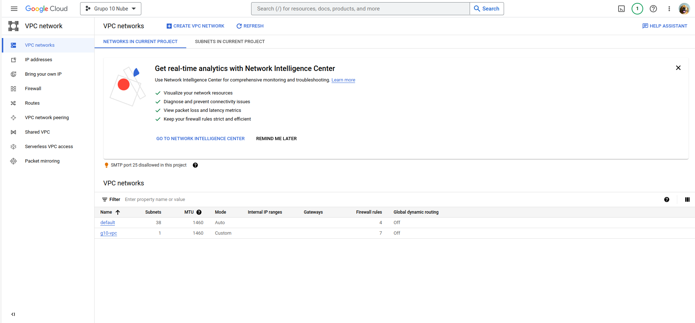
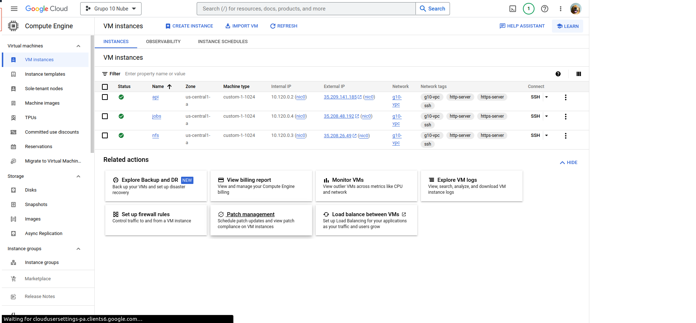
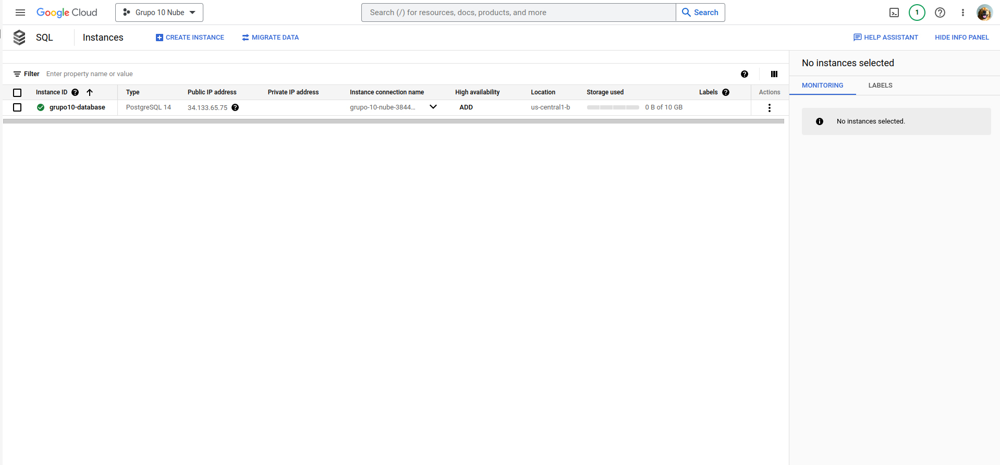
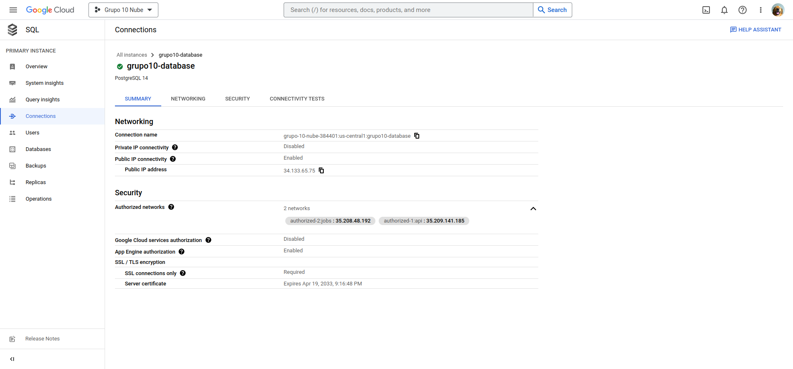
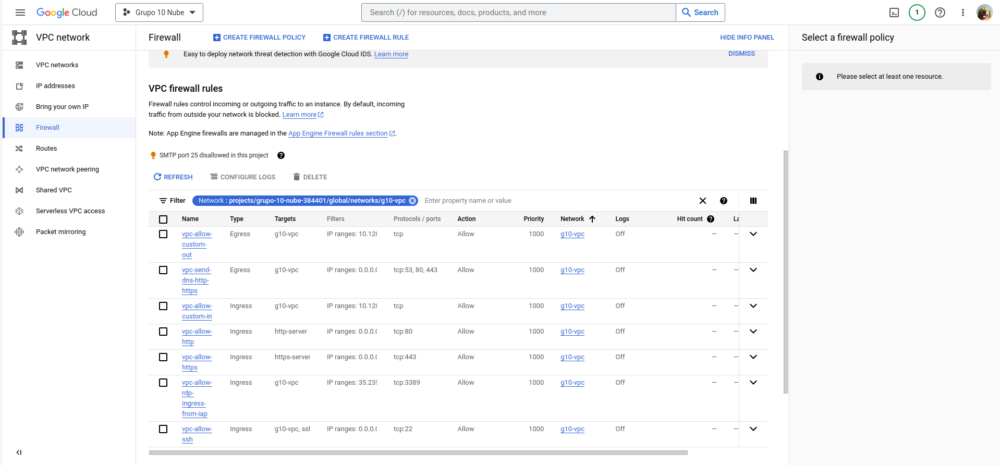
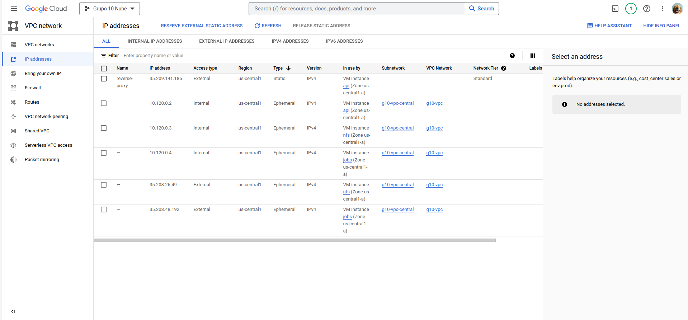

# Memorias de la configuración de la infraestructura en GCloud (Segunda entrega)

## 1) Creación de la VPC

## 2) Creación de las instancias

## 3) Creación de la base de datos

## 4) Creación de las reglas de firewall

## 5) Ips de las instancias

